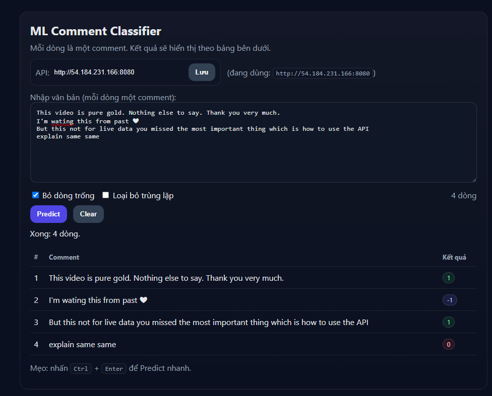

# MLOps_Classifier_Comment
📝 MLOps Classifier Comment
📌 Giới thiệu

Đây là dự án triển khai End-to-End MLOps pipeline cho bài toán phân loại bình luận (Comment Classification).
Ứng dụng giúp huấn luyện, đánh giá và triển khai mô hình phân loại bình luận với quy trình tự động hóa, có thể mở rộng và giám sát dễ dàng.
## UI basic using chat GPT

## 🚀 Tính năng chính

Thu thập & tiền xử lý dữ liệu văn bản.

Huấn luyện và so sánh nhiều mô hình (RandomFores, v.v).

Quản lý thí nghiệm bằng MLflow/DVC.

CI/CD với GitHub Actions + AWS EC2.

Triển khai mô hình với Flask + Docker.

Theo dõi & giám sát bằng MLflow.

## ⚙️ Cài đặt
Yêu cầu

Python >= 3.10

pip hoặc conda

Docker (khuyến nghị cho triển khai)

Git + DVC (nếu muốn versioning dữ liệu)

## Training MLflow
AWS EC2 server
AWS S3 lưu trữ kết quả model training

sử dụng MLflow giám sát log metric parammert, so sánh kết quả
Chọn model tốt nhất --> Register qua các version
Pipline Training with DVC

###  📈 Monitoring

Metrics và logs được lưu với MLflow.

Có thể tích hợp Prometheus + Grafana để giám sát môi trường production.

#with specific access

1. EC2 access : It is virtual machine

2. ECR: Elastic Container registry to save your docker image in aws

# Login to AWS console.

# Description: About the deployment

1. Build docker image of the source code

2. Push your docker image to ECR

3. Launch Your EC2 

4. Pull Your image from ECR in EC2

5. Lauch your docker image in EC2

#Policy:

1. AmazonEC2ContainerRegistryFullAccess

2. AmazonEC2FullAccess

# Create ECR repo to store/save docker image

# Create EC2 machine (Ubuntu)

# Open EC2 and Install docker in EC2 Machine:
#optinal

sudo apt-get update -y

sudo apt-get upgrade

#required

curl -fsSL https://get.docker.com -o get-docker.sh

sudo sh get-docker.sh

sudo usermod -aG docker ubuntu

newgrp docker

# Setup github secrets:

AWS_ACCESS_KEY_ID=

AWS_SECRET_ACCESS_KEY=

AWS_REGION = us-east-1

AWS_ECR_LOGIN_URI = demo>>  566373416292.dkr.ecr.ap-south-1.amazonaws.com

ECR_REPOSITORY_NAME = simple-app